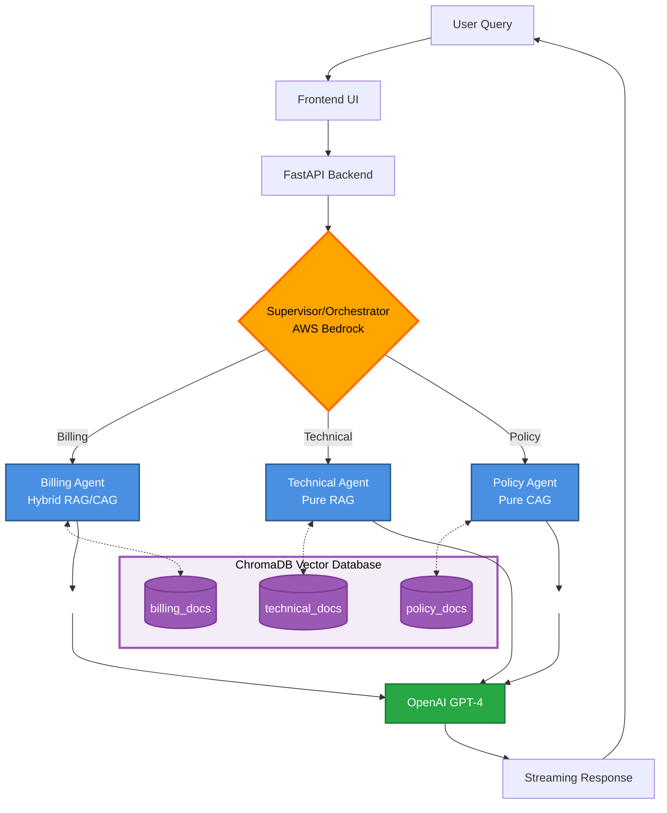
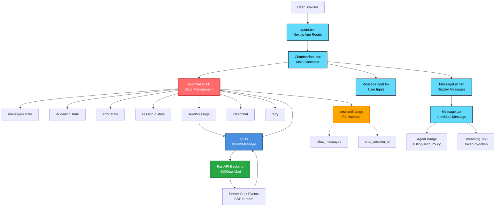

# Multi-Agent Customer Service AI

A sophisticated customer service application powered by a multi-agent AI system. This project demonstrates a modern, scalable architecture for handling diverse customer inquiries by routing them to specialized AI agents.

## Architecture

- **Backend**: FastAPI with LangGraph orchestration
- **AI Agents**: Orchestrator + 3 specialized workers
  - Billing Support (Hybrid RAG/CAG)
  - Technical Support (Pure RAG)
  - Policy & Compliance (Pure CAG)
- **Frontend**: Next.js with shadcn/ui
- **Vector Database**: ChromaDB
- **LLM Providers**: OpenAI GPT-4, AWS Bedrock Claude 3.5

### System Flow Diagram



**Key Architecture Highlights:**

1. **Multi-Provider LLM Strategy**:
   - 🔀 **Routing**: AWS Bedrock (Claude 3.5 Haiku) - Fast & cost-effective (~$0.0001/query)
   - 🎯 **Response Generation**: OpenAI GPT-4 - High-quality answers (~$0.03/query)

2. **Three Retrieval Strategies**:
   - **Pure RAG** (Technical): Every query retrieves fresh context from vector store
   - **Pure CAG** (Policy): All documents pre-loaded in memory, instant responses
   - **Hybrid RAG/CAG** (Billing): First query uses RAG, subsequent queries use cached context

3. **Streaming Architecture**: Server-Sent Events (SSE) for real-time token-by-token response delivery

---

### Frontend Architecture Diagram



**Frontend Architecture Highlights:**

1. **Component Structure**:
   - **Next.js App Router**: Modern React 18+ with server components
   - **Modular Components**: ChatInterface → MessageList + MessageInput
   - **Reusable UI**: shadcn/ui components (Button, Card, Input, ScrollArea)

2. **State Management**:
   - **useChat Hook**: Custom hook managing all chat state and logic
   - **Real-time Updates**: Streaming responses update state token-by-token
   - **Session Persistence**: sessionStorage preserves chat across page refreshes

3. **API Communication**:
   - **Streaming API**: Server-Sent Events (SSE) for live responses
   - **Type Safety**: Full TypeScript with defined interfaces
   - **Error Handling**: Retry mechanism with error state management

4. **UX Enhancements**:
   - **Auto-focus**: Input field automatically focuses after each response
   - **Agent Badges**: Visual indicators showing which agent responded
   - **Smooth Scrolling**: Auto-scroll to latest message

---

## Features

- 🤖 Multi-agent system with intelligent query routing
- 💬 Real-time streaming chat interface
- 📚 Multiple retrieval strategies (RAG, CAG, Hybrid)
- 🔄 Stateful conversation management
- 🎨 Modern, responsive UI

## Prerequisites

- Python 3.10 or higher
- Node.js 18 or higher
- OpenAI API key
- AWS credentials with Bedrock access

## Setup Instructions

### 1. Clone the Repository

```bash
git clone <repository-url>
cd agent-proj2
```

### 2. Backend Setup

```bash
cd backend

# Create virtual environment
python -m venv venv

# Activate virtual environment
# On Windows (PowerShell):
venv\Scripts\Activate.ps1
# On Windows (Command Prompt):
venv\Scripts\activate.bat
# On macOS/Linux:
source venv/bin/activate

# Upgrade pip
python -m pip install --upgrade pip

# Install dependencies
pip install -r requirements.txt

# Configure environment variables
cp env.example .env
# Edit .env with your actual API keys:
# - OPENAI_API_KEY
# - AWS_ACCESS_KEY_ID
# - AWS_SECRET_ACCESS_KEY
# - AWS_SESSION_TOKEN (Required for AWS Academy/Learner Lab)
# - AWS_REGION
```

**Important Notes:**
- **AWS Academy Users**: You MUST include `AWS_SESSION_TOKEN` in your `.env` file. These credentials expire every few hours, so you'll need to refresh them from AWS Academy → AWS Details → AWS CLI.
- Keep the virtual environment activated for all subsequent backend commands!

### 3. Frontend Setup

```bash
cd frontend

# Install dependencies
npm install

# Configure environment variables
cp env.example .env.local
# Edit .env.local if needed
```

### 4. Data Ingestion

Before running the application, you need to ingest the mock documents into ChromaDB:

```bash
cd backend

# Make sure your virtual environment is activated and .env is configured
python ingest_data.py
```

This script will:
- Load documents from `data/mock_documents/`
- Split them into chunks
- Generate embeddings using OpenAI
- Store them in ChromaDB collections:
  - `billing_docs`: For the Billing Support Agent
  - `technical_docs`: For the Technical Support Agent
  - `policy_docs`: For the Policy & Compliance Agent

**Expected output:** You should see confirmation that documents were loaded and embedded for all three categories.

**Troubleshooting:**
- If you get OpenAI errors, verify your `OPENAI_API_KEY` in `.env`
- The script creates a `chroma_db/` directory in the backend folder

---

## Testing the System

### Step-by-Step Testing Guide

**Prerequisites for ALL tests:**
- Backend virtual environment must be activated
- Navigate to `backend/` directory
- `.env` file configured with API keys

**Activate Virtual Environment:**
```powershell
# Windows PowerShell
cd backend
.\venv\Scripts\Activate.ps1
```
```bash
# macOS/Linux
cd backend
source venv/bin/activate
```

You should see `(venv)` at the beginning of your terminal prompt.

---

#### Test 1: Verify LLM Configuration

**Platform:** Windows, macOS, Linux  
**Requires:** Virtual environment activated

```bash
python test_llm_setup.py
```

**Expected Result:**
- ✓ OpenAI configured successfully
- ✓ Bedrock configured successfully
- ✓ All 3 ChromaDB collections found

**If this fails:**
- Check your API keys in `backend/.env`
- Ensure you've run `ingest_data.py`
- For AWS Bedrock, verify your region supports Claude models

---

#### Test 2: Test Individual Agents

**Platform:** Windows, macOS, Linux  
**Requires:** Virtual environment activated (see above)

```bash
python test_agents.py
```

**Expected Result:**
- ✓ Billing Agent works (shows Hybrid RAG/CAG strategy)
- ✓ Technical Agent works (shows Pure RAG with sources)
- ✓ Policy Agent works (shows Pure CAG with all docs loaded)
- ✓ Streaming responses work

**This validates:** Each agent's retrieval strategy is working correctly.

---

#### Test 3: Test Orchestrator Routing

**Platform:** Windows, macOS, Linux  
**Requires:** Virtual environment activated (see above)

```bash
python test_orchestrator.py
```

**Expected Result:**
- ✓ 80%+ routing accuracy across 15 test queries
- ✓ Full workflow completes
- ✓ Streaming works
- ✓ Conversation context maintained

**This validates:** The orchestrator correctly routes queries to appropriate agents.

---

#### Test 4: Start Backend Server

**Platform:** Windows, macOS, Linux  
**Requires:** Virtual environment activated (see above)  
**Terminal:** Keep this terminal running!

```bash
python -m app.main
```

**Expected Output:**
```
Policy Agent: Loaded 48 policy documents into memory
INFO:     Started server process [xxxxx]
INFO:     Waiting for application startup.
INFO:     Application startup complete.
INFO:     Uvicorn running on http://0.0.0.0:8000
```

**⚠️ IMPORTANT: Keep this terminal running! Do not close it.**

---

#### Test 5: Test API Endpoints

**Terminal:** Open a NEW terminal (backend server must still be running in first terminal)  
**Requires:** Virtual environment activated in NEW terminal

```powershell
# Windows PowerShell - NEW TERMINAL
cd backend
.\venv\Scripts\Activate.ps1
python test_api.py
```

```bash
# macOS/Linux - NEW TERMINAL
cd backend
source venv/bin/activate
python test_api.py
```

**Expected Result:**
- ✓ Health check passes
- ✓ Non-streaming chat works
- ✓ Streaming chat works
- ✓ Session management works
- ✓ Routing test endpoint works

**This validates:** The FastAPI server is working correctly.

---

#### Test 6: Start Frontend

**Terminal:** Open another NEW terminal (3rd terminal total)  
**Requires:** Node.js/npm (NO virtual environment needed)

```powershell
# Windows PowerShell - NEW TERMINAL
cd frontend
npm install                # First time only
cp env.example .env.local  # First time only
npm run dev
```

```bash
# macOS/Linux - NEW TERMINAL
cd frontend
npm install                # First time only
cp env.example .env.local  # First time only
npm run dev
```

**Expected Output:**
```
- ready started server on 0.0.0.0:3000
- Local:        http://localhost:3000
```

---

#### Test 7: End-to-End Browser Test

1. **Open browser**: Navigate to `http://localhost:3000`

2. **Test Billing Agent**:
   - Type: "What are your pricing plans?"
   - Watch the streaming response
   - Follow up: "What's in the Enterprise plan?" (should use cached context)

3. **Test Technical Agent**:
   - Type: "How do I reset my password?"
   - Verify you get step-by-step instructions
   - Note: Each query performs new retrieval (Pure RAG)

4. **Test Policy Agent**:
   - Type: "What's your privacy policy?"
   - Verify instant response (documents loaded in memory)
   - Follow up: "Are you GDPR compliant?"

5. **Test Streaming**:
   - Observe responses appearing word-by-word in real-time
   - Verify smooth, natural streaming experience

6. **Test Session Persistence**:
   - Refresh the page
   - Conversation history should persist

7. **Test Clear Chat**:
   - Click "Clear Chat" button
   - Verify conversation resets

---

## Quick Testing Commands Summary

### Windows PowerShell
```powershell
# Terminal 1 - Backend Setup & Testing
cd backend
python -m venv venv
.\venv\Scripts\Activate.ps1
pip install -r requirements.txt
cp env.example .env  # Edit with your API keys
python ingest_data.py
python test_llm_setup.py
python test_agents.py
python test_orchestrator.py
python -m app.main  # Keep running

# Terminal 2 - API Testing (optional)
cd backend
.\venv\Scripts\Activate.ps1
python test_api.py

# Terminal 3 - Frontend
cd frontend
npm install
cp env.example .env.local
npm run dev

# Browser: Open http://localhost:3000
```

### macOS/Linux
```bash
# Terminal 1 - Backend Setup & Testing
cd backend
python -m venv venv
source venv/bin/activate
pip install -r requirements.txt
cp env.example .env  # Edit with your API keys
python ingest_data.py
python test_llm_setup.py
python test_agents.py
python test_orchestrator.py
python -m app.main  # Keep running

# Terminal 2 - API Testing (optional)
cd backend
source venv/bin/activate
python test_api.py

# Terminal 3 - Frontend
cd frontend
npm install
cp env.example .env.local
npm run dev

# Browser: Open http://localhost:3000
```

**📖 For detailed step-by-step testing instructions with expected outputs, see [TESTING_GUIDE.md](TESTING_GUIDE.md)**

## Running the Application

### Start Backend Server

**Requires:** Virtual environment activated

```powershell
# Windows PowerShell
cd backend
.\venv\Scripts\Activate.ps1
python -m app.main
```

```bash
# macOS/Linux
cd backend
source venv/bin/activate
python -m app.main
```

The API will be available at `http://localhost:8000`

**API Endpoints:**
- `GET /` - Health check
- `GET /health` - Detailed health with LLM status
- `POST /api/chat` - Main chat endpoint (supports streaming)
- `GET /api/chat/sessions/{session_id}` - Get session info
- `DELETE /api/chat/sessions/{session_id}` - Delete session
- `GET /api/chat/sessions` - List all sessions
- `POST /api/chat/test` - Test routing without executing

**Test the API:**
```powershell
# Windows PowerShell - New terminal
cd backend
.\venv\Scripts\Activate.ps1
python test_api.py
```

```bash
# macOS/Linux - New terminal
cd backend
source venv/bin/activate
python test_api.py
```

### Start Frontend Development Server

**Requires:** Node.js/npm (NO virtual environment needed)

```powershell
# Windows PowerShell
cd frontend
cp env.example .env.local  # First time only
npm run dev
```

```bash
# macOS/Linux
cd frontend
cp env.example .env.local  # First time only
npm run dev
```

The application will be available at `http://localhost:3000`

## Testing the Complete System

### End-to-End Test

**Terminal 1 - Backend** (with venv activated):
```powershell
# Windows
cd backend
.\venv\Scripts\Activate.ps1
python -m app.main
```
```bash
# macOS/Linux
cd backend
source venv/bin/activate
python -m app.main
```

**Terminal 2 - Frontend** (NO venv needed):
```bash
cd frontend
npm run dev
```

**Browser**:
1. Navigate to `http://localhost:3000`
2. Try example queries from `EXAMPLE_QUERIES.md`

### Verify Each Agent

- **Billing Agent**: "What are your pricing plans?"
- **Technical Agent**: "How do I reset my password?"
- **Policy Agent**: "What's your privacy policy?"

Watch the streaming responses and observe which agent handles each query!

## Environment Variables

### Backend (.env)

```
OPENAI_API_KEY=your-openai-api-key
AWS_ACCESS_KEY_ID=your-aws-access-key
AWS_SECRET_ACCESS_KEY=your-aws-secret-key
AWS_SESSION_TOKEN=your-aws-session-token  # Required for AWS Academy/Learner Lab
AWS_REGION=us-east-1
CHROMA_PERSIST_DIR=./chroma_db
```

**Note for AWS Academy Users**: 
- AWS Academy provides **temporary credentials** that expire every few hours
- You must include all three: `AWS_ACCESS_KEY_ID`, `AWS_SECRET_ACCESS_KEY`, and `AWS_SESSION_TOKEN`
- To refresh: Go to AWS Academy → Your Course → AWS Details → AWS CLI: Show → Copy all three values

### Frontend (.env.local)

```
NEXT_PUBLIC_API_URL=http://localhost:8000
```

## Example Queries

See `EXAMPLE_QUERIES.md` for a comprehensive list of test queries for each agent.

### Quick Examples

#### Billing Agent (Hybrid RAG/CAG)
- "What's the pricing for the enterprise plan?"
- "How can I view my invoices?"
- "What payment methods do you accept?"

#### Technical Support Agent (Pure RAG)
- "How do I reset my password?"
- "My API authentication is failing"
- "How to integrate the webhook system?"

#### Policy & Compliance Agent (Pure CAG)
- "What's your data retention policy?"
- "Do you comply with GDPR?"
- "What are the terms of service?"

## Technology Stack

- **Backend**: FastAPI, LangChain, LangGraph, ChromaDB
- **Frontend**: Next.js, React, TypeScript, Tailwind CSS, shadcn/ui
- **AI/LLM**: OpenAI GPT-4, AWS Bedrock Claude 3.5
- **Database**: ChromaDB (vector database)

## Troubleshooting

### Backend Issues

**ChromaDB not found:**
```bash
cd backend
python ingest_data.py
```

**LLM Provider errors:**
```bash
python test_llm_setup.py  # Verify credentials
```

**AWS Bedrock "ExpiredTokenException" error:**
This happens when AWS Academy credentials expire (every few hours).
```bash
# 1. Go to AWS Academy → Your Course → AWS Details → AWS CLI: Show
# 2. Copy the three values: AWS_ACCESS_KEY_ID, AWS_SECRET_ACCESS_KEY, AWS_SESSION_TOKEN
# 3. Update backend/.env with all three values
# 4. Restart backend server
```

**Routing to wrong agent (always Technical Support):**
- Check if you have multiple backend servers running
- Stop all Python processes and restart:
```powershell
# Windows PowerShell
Get-Process python | Where-Object {$_.Path -like "*agent-proj2*"} | Stop-Process -Force
# Then restart backend
cd backend
. .\venv\Scripts\Activate.ps1
python -m app.main
```

**Port already in use:**
```bash
# Change PORT in backend/.env
PORT=8001
```

### Frontend Issues

**Cannot connect to backend:**
- Ensure backend is running on port 8000
- Check `NEXT_PUBLIC_API_URL` in `frontend/.env.local`

**Dependencies not found:**
```bash
cd frontend
npm install
```

## Development

This project follows the Vibe Coding Strategy - a natural language-driven, iterative development approach guided by AI tools.

## Project Structure

```
agent-proj2/
├── backend/
│   ├── app/
│   │   ├── agents/          # Specialized AI agents
│   │   ├── graph/           # LangGraph orchestrator
│   │   ├── routes/          # API endpoints
│   │   ├── config.py        # Configuration
│   │   ├── llm_providers.py # LLM factories
│   │   ├── retrievers.py    # ChromaDB utilities
│   │   ├── sessions.py      # Session management
│   │   └── main.py          # FastAPI app
│   ├── ingest_data.py       # Data ingestion script
│   ├── test_*.py            # Test scripts
│   └── requirements.txt     # Python dependencies
├── frontend/
│   ├── app/                 # Next.js app directory
│   ├── components/          # React components
│   ├── hooks/               # Custom hooks (useChat)
│   ├── lib/                 # API client & utilities
│   └── package.json         # Node dependencies
├── data/
│   └── mock_documents/      # Knowledge base documents
│       ├── billing/         # Billing documents
│       ├── technical/       # Technical docs
│       └── policy/          # Policy documents
├── EXAMPLE_QUERIES.md       # Test queries
└── README.md                # This file
```

## License

MIT

## Author

Developed as a proof-of-concept for advanced AI engineering skills demonstration.

